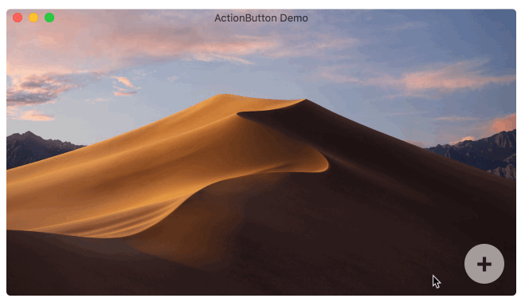

Fab. 🛍️
----

<!--[](http://cocoadocs.org/docsets/Fab) 
[](http://cocoadocs.org/docsets/Fab/) 
[](https://github.com/Carthage/Carthage)
[](https://developer.apple.com/swift) 
[](https://github.com/piemonte/Player/blob/master/LICENSE)


-->

<div style="text-align:center">
	<a href="http://cocoadocs.org/docsets/Fab" style="text-decoration:none">
		
	</a>


	<br>

	
</div>

<p align="center"><code>Fab</code> is a <b>F</b>loating <b>A</b>ction <b>B</b>utton inspired by Material Design, and written in Swift.

<br>

Based on Lourenço Marinho's <a href="https://github.com/lourenco-marinho/ActionButton"><code>ActionButton</code></a> for UIKit.
<br></p>

--

### Features

- [x] Dark Mode
	
	
- [x] + more.


Installation
----

`Fab` is available for installation using CocoaPods or Carthage.

### [CocoaPods](http://cocoapods.org/)

```ruby
pod "Fab"
```

### [Carthage](https://github.com/Carthage/Carthage)

```ruby
github "chriszielinski/Fab"
```


Requirements
----

- macOS 10.12+


Usage
----

#### Create `FabItem`s
```swift
let shareItem = FabItem(label: "Share", shareImage)
shareItem.action = { item in
	print("Selected \"Share\"")
}

let emailItem = FabItem(label: "Email", emoji: "✉️") { item in
	print("Selected \"Email\"")
}
```

#### Create `Fab` with items.
```swift
let fab = Fab(attachedTo: aView, items: [shareItem, emailItem])
```


Try Me
----

Includes a Playground and Demo.app.


Documentation
----

You can find the docs [here](http://chriszielinski.github.io/Fab/). Documentation is generated with [jazzy](https://github.com/realm/jazzy) and hosted on [GitHub-Pages](https://pages.github.com).


Who to blame
----

- 


--
### // ToDo:

- [ ] Tests.

### // CouldDo:

- [ ] Use CALayer.
- [ ] Internal refactoring.


Acknowledgements
----

* Based on Lourenço Marinho's [`ActionButton`](https://github.com/lourenco-marinho/ActionButton) for UIKit.


Contributors
----

- [Chris Zielinski](https://github.com/chriszielinski) — Original author.


License
----

Fab is released under the MIT license. See LICENSE for details.
